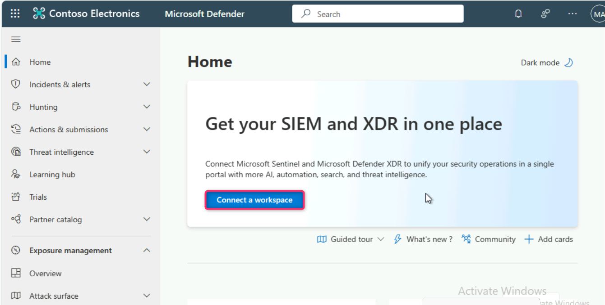

**Lab 2: Connecting Microsoft Sentinel in Microsoft Defender Portal for
Threat Hunting, Triage, Investigation, and Response**

## Introduction

Microsoft Sentinel's Microsoft Defender XDR incident integration allows
you to stream all Microsoft Defender XDR incidents into Microsoft
Sentinel and keep them synchronized between both portals. Incidents from
Microsoft Defender XDR include all associated alerts, entities, and
relevant information, providing you with enough context to perform
triage and preliminary investigation in Microsoft Sentinel. Once in
Sentinel, incidents will remain bi-directionally synced with Microsoft
Defender XDR, allowing you to take advantage of the benefits of both
portals in your incident investigation using Microsoft Copilot for
Security.

## Objectives

- Creating a workspace and activating Microsoft Sentinel free trial.

- Connecting Microsoft Dender for Endpoint and Microsoft Defender XDR
  data connectors to Sentinel for enhancing security capabilities.

- Connecting Microsoft Sentinel and Microsoft Defender XDR to unify your
  security operation in a single portal.

**Task 1: Creating a workspace and activating Microsoft Sentinel free
trial**

1.  In the Azure portal search box, type **Microsoft Sentinel**, then
    navigate down to **Services** section and click on **Microsoft
    Sentinel** from the list.

 

2.  In Microsoft Sentinel page, click on **+Create**.

 

3.  In **Add Microsoft Sentinel to a workspace** page, click on **+**
    **Create a new workspace**.

 

4.  In **Create Log Analytics workspace** page, enter the following
    details, then click on **Review and create** button.

[TABLE]

 

5.  In **Create Log Analytics workspace** page, after Validation passed,
    click on the **Create** button.

6.  After few minutes, the workspace will be successfully created.

**Note**: In case, you did not see the workspace, then refresh the page.

7.  Select the workspace, then click on the **Add** button.

8.  On Microsoft Sentinel free trial activated dialog box, click on the
    **OK** button.

**Task 2: Connecting Microsoft Dender for Endpoint and Microsoft
Defender XDR data connectors to Sentinel for enhancing security
capabilities**

1.  Scroll down to **Content management** section and click on **Content
    hub**.

2.  In the **content hub** search bar, type **defender for endpoint**
    and press the enter button.

 

3.  Scroll down and select **Microsoft Defender for Endpoint**, then
    select the **Install** button on the right-sided pane.

 

4.  Click on **Manage** button.

 **Note**: In case, you did not see the Manage button, then select
 again **Microsoft Defender for Endpoint** as shown in the below image.

 

5.  On **Microsoft Defender for Endpoint** page, navigate to **Content
    name** column, check the box beside **Microsoft Defender for
    Endpoint** as shown in the below image. Then, click on **Open
    connector** **page** button.

 

 

6.  Navigate to **Configuration** section and click on **Connect**
    button. You’ll received a notification – **Successfully connected
    Microsoft Defender for Endpoint alerts**.

 

 

 

7.  Click on **Microsoft Sentinel | Content hub** link below the Azure
    search bar as shown in the below image. In the **Microsoft Sentinel
    | Content hub** page search bar, type **Microsoft Defender XDR** and
    press the enter button. Scroll down and select **Microsoft Defender
    XDR**.

8.  In **Microsoft Defender XDR** pane that appears on the right side,
    navigate and click on **Install** button.

9.  Click on the **Manage** button.

 

10. In **Microsoft Defender XDR** page, navigate and select the check
    box of **Microsoft Defender XDR**, then click on **Open connector
    page** button.

 

11. Scroll down to **Configuration** section. Ensure to check the box of
    **Turn off all Microsoft incident creation rules for these
    products**, then click on the **Connect incidents & alerts** button.

 

 

12. Select all the Microsoft Defender XDR products except

- Microsoft Defender for Cloud Apps (0/1 connected)​

- Microsoft Defender for Identity (0/3 connected)​

Click on **Apply** **changes** button.

 

 

 

 

13. Scroll up to **Configuration** section, if Microsoft Defender XDR is
    successfully connected, then you’ll see the **Disconnect** button as
    shown in the below image. In case, if you see **Connect Incidents &
    alerts** on the button, then click on it.

 

14. Go back to **Microsoft Defender** portal and **Sign out** from it.

**Task 3: Connecting Microsoft Sentinel and Microsoft Defender XDR**

1.  Open a new address bar and enter the following link to open the
    Microsoft Defender Portal: **<https://security.microsoft.com**

2.  Select your O365 tenant ID.

3.  Enter the password.

4.  In **Stay signed in?** window, click on the **Yes** button.

5.  In **Get your SIEM and XDR in one place** dialog box, click on
    **Connect a workspace** button.

6.  Select MylogworkspaceXXXX workspace and click on the **Next**
    button.

7.  In the **Review changes** page, click on the **Connect** button.

8.  Wait for few minutes for the workspace to be successfully connected
    to Microsoft 365 Defender. After workspace successfully connected,
    click on the **Close** button.

## Summary 

In this lab, you've gained valuable hands-on experience in setting up
and configuring Microsoft Sentinel, a powerful security information and
event management (SIEM) system. By following the detailed instructions,
you successfully created a workspace and activated the Microsoft
Sentinel free trial, ensuring a solid foundation for security monitoring
and incident response. Additionally, you learned to connect crucial data
connectors, such as Microsoft Defender for Endpoint and Microsoft
Defender XDR, enabling seamless integration of security solutions within
the Sentinel environment. Furthermore, you mastered the process of
connecting Microsoft Sentinel and Microsoft Defender XDR, consolidating
security monitoring efforts and enhancing overall defense strategies.
Your proficiency in these tasks equips you with essential skills for
effectively managing and securing your organization's digital assets.
