**Lab 3: Creating a multi-stage incident in Microsoft Defender**

**Introduction**

In this lab, you’ll be creating a multi-stage incident in Microsoft
Defender by executing malicious documents and scripts in testvm1. The
multi-stage incident will be analyzed in the upcoming labs using
Microsoft Copilot for Security.

**Objectives**

- To install Git and download repositories having malware payloads on
  testvm1 in Azure.

- To run malicious documents and scripts.

- To perform a ransomware attack using RanSim.

- To check protection action and recommendations from Windows Security.

## **Task 1: Install git and download the payloads on testvm1**

> 1\. In the Azure portal search bar, type virtual machine, then
> navigate and click on **Virtual machines** under **Services**.

2\. In the **Virtual machines** page, navigate and click on **testvm1**.
On **testvm1** Virtual machine page, click on the **Start** button.

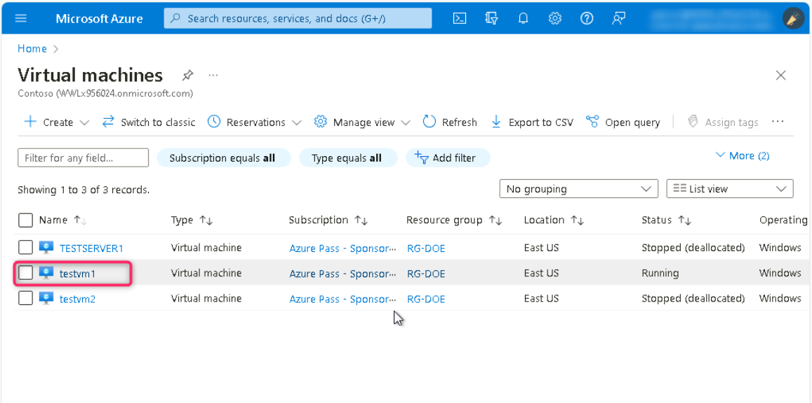

3.  Wait for few minutes for the virtual machine to start, then navigate
    and click on **Connect** on the left side navigation menu, scroll
    down to **Native RDP** tile, and click on the **Download RDP file**.

4.  On **testvm1.rdp could harm your device. Do you want to keep it
    anyway?** dialog box, click on **Keep** button.

>  alt="A screenshot of a computer Description automatically generated" />

5.  On **testvm1.rdp** file, click on **Open file** link.

> 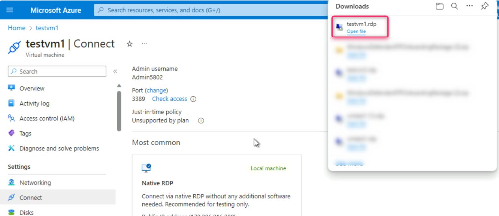 alt="A screenshot of a computer Description automatically generated" />

6.  On **The publisher of this remote connection can’t be identified. Do
    you want to connect anyway?** dialog box, click on **Connect**
    button.

> 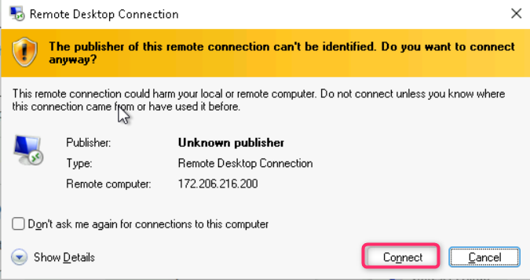 alt="A screenshot of a computer Description automatically generated" />

7.  On **Enter your credentials** dialog box, enter the password (here,
    **Administrator5801@\***) and click on the **OK** button.

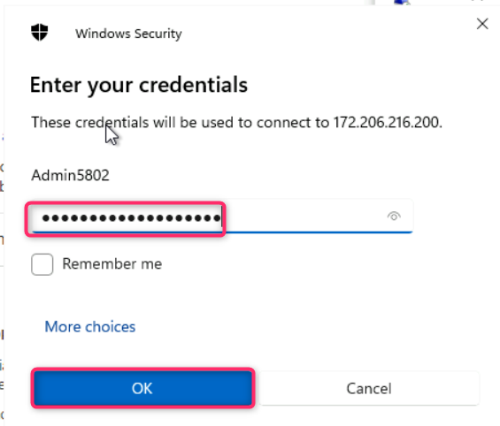

8.  On **The identity of the remote computer cannot be verified. Do you
    want to connect anyway?** dialog box, click on **Yes** button.

9.  Open the Edge browser, navigate to the address bar and enter the
    following link: **https://git-scm.com/downloads**

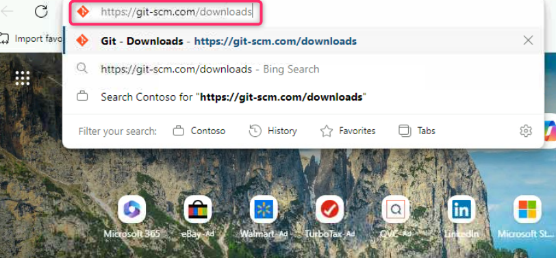

10. On **git** window, navigate to **Downloads** section and click on
    **Windows** as shown in the below image.

11. On **Download for Windows** page, navigate to **Standalone
    Installer** and click on **64-bit Git for Windows Setup**.

12. Click on the **Git.exe** file.

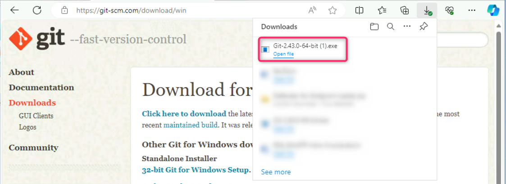

13. On **Git Setup** - **Information** dialog box, click on the **Next**
    button.

14. On **Select Destination Location** dialog box, click on the **Next**
    button.

15. On **Select Components** dialog box, click on the **Next** button.

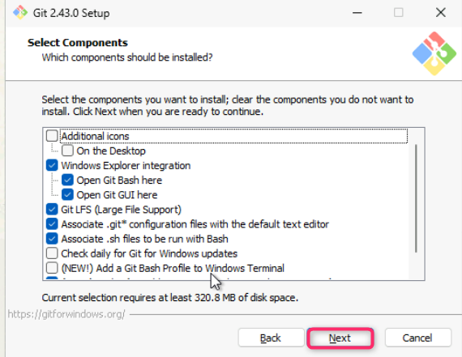

16. On **Select Start Menu Folder** dialog box, click on the **Next**
    button.

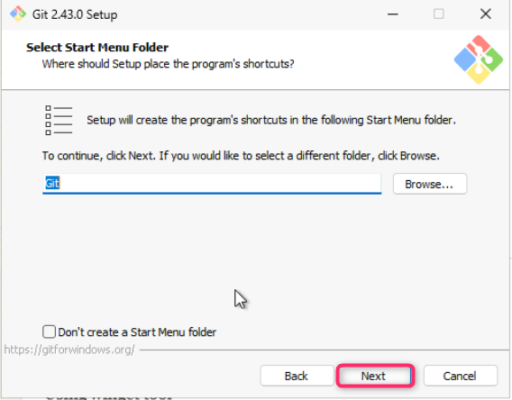

17. On **Choosing the default editor used by Git** dialog box, click on
    the **Next** button.

18. Leave **Adjusting the name of the initial branch in new
    repositories** dialog box in default state and click on the **Next**
    button.

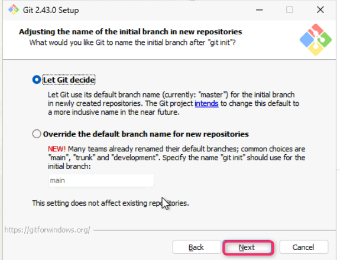

19. Leave **Adjusting your PATH environment** dialog box in default
    state and click on the **Next** button.

20. Leave **Choosing the SSH executable** dialog box in default state
    and click on the **Next** button.

21. Leave **Choosing HTTPS transport backend** dialog box in default
    state and click on the **Next** button.

22. Leave **Configuring the line ending conversions** dialog box in
    default state and click on the **Next** button.

23. Leave **Configuring the terminal emulator to use with Git Bash**
    dialog box in default state and click on the **Next** button.

24. Leave **Choose the default behavior of ‘git pull’** dialog box in
    default state and click on the **Next** button.

25. Leave **Choose a credential helper** dialog box in default state and
    click on the **Next** button.

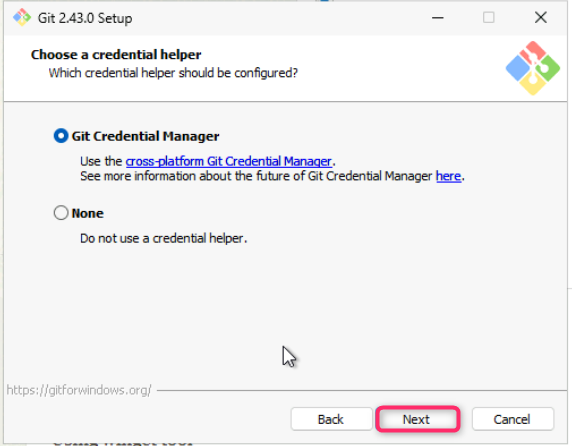

26. Leave **Configuring extra options** dialog box in default state and
    click on the **Next** button.

27. Leave **Configuring experimental options** dialog box in default
    state and click on the **Next** button.

28. Wait for few minutes for the installation to complete.

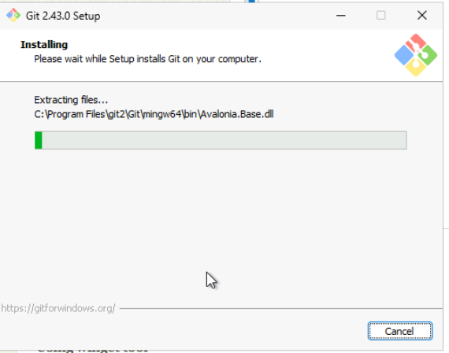

29. Select **Launch Git Bash** checkbox and then click on the **Finish**
    button.

## **Task 2: Executing Malicious Documents and Scripts**

1.  In **Git Bash**, execute the following command to download
    **examples** folder containing various malware files and scripts.

**git clone https://github.com/directorcia/examples**

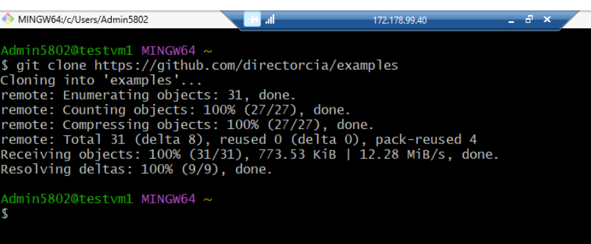

2.  Navigate to **C:\Users\Admin5802**, then click on **examples**
    folder as shown in the below image.

3.  You will see various malwares files and script.

4.  Right click on **RS4_WinATP-Intro-Invoice** and open the file in
    word.

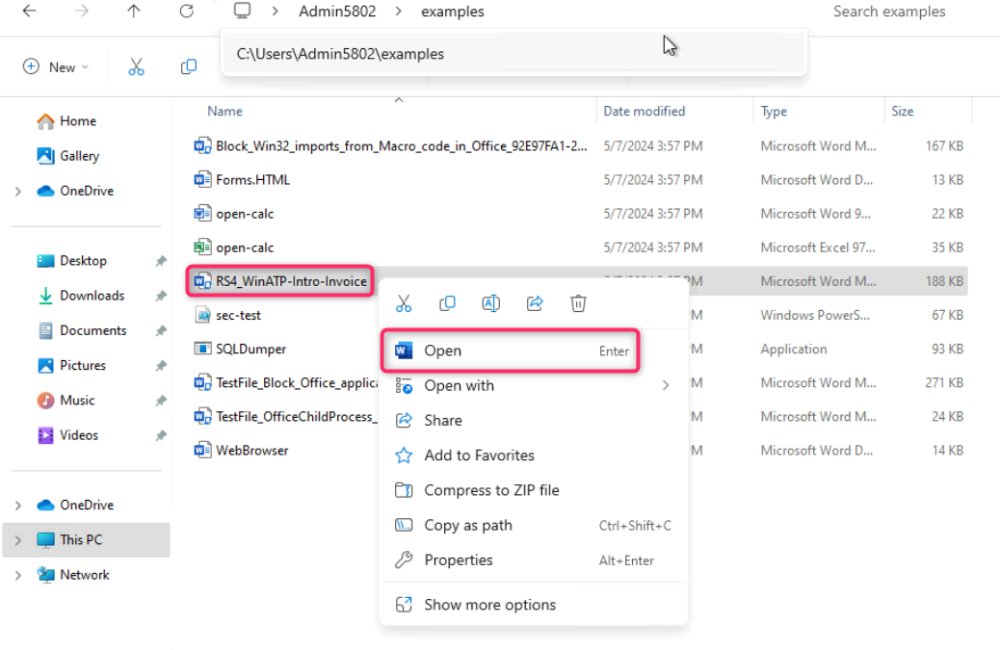

5.  You will be prompted to enter the password, provide the password as
    +++**WDATP!diy#**+++ and click on the **OK** button.

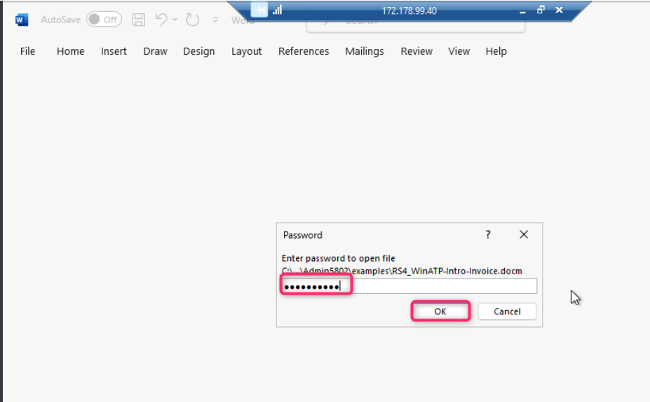

6.  The file will open with a **SECURITY WARNING**, click on the
    **Enable content** button as shown in the below image.

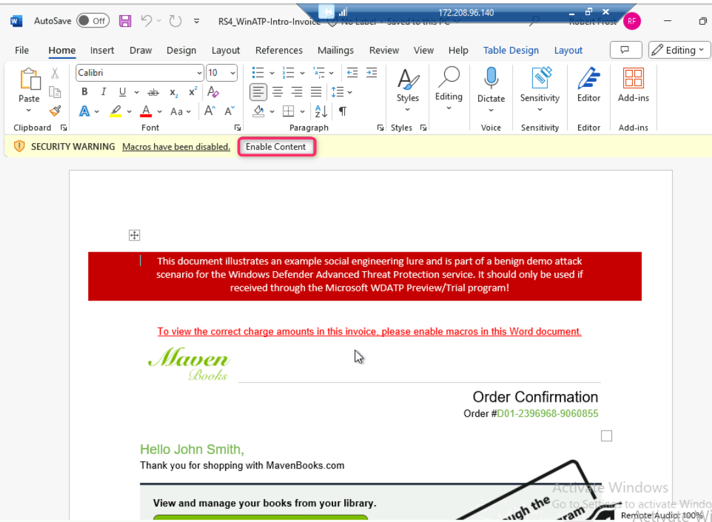

7.  You’ll be prompted about a demo attack, click on the **OK** button.

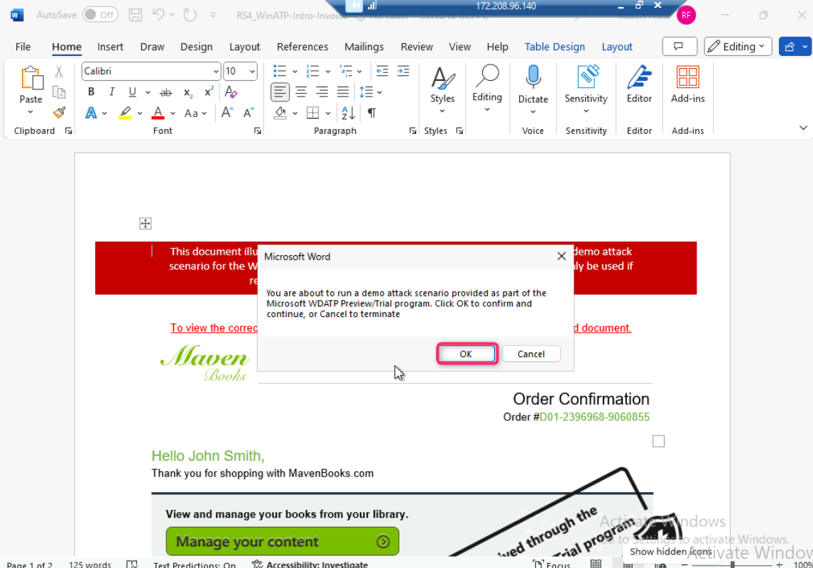

8.  A new file **WinATP-Intro-Backdoor.exe**, which represents the
    backdoor, is created onto the Desktop by a PowerShell script
    launched from the word document.

9.  The script goes on to create a scheduled task to launch the backdoor
    at a predefined time. This mechanism of indirect process launch is
    sometimes used for stealth, as it is harder to trace back to the
    document.

**Note**: When the backdoor is launched, it creates an auto-start entry
under the registry Run key, allowing it to stay persistent by starting
automatically with Windows. A Command Prompt window opens, indicating
that the simulated backdoor is running. Close the Command Prompt window
to end the **WinATP-Intro-Backdoor.exe** process. In case, you did not
see the Command Prompt window, then move on to the next step.

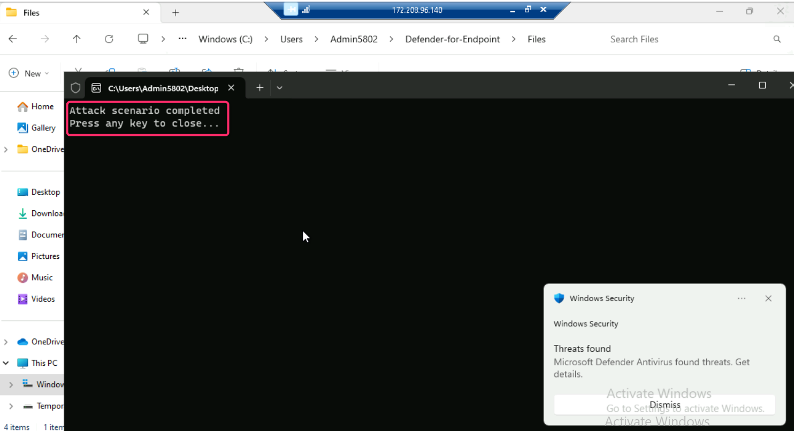

10. Open
    **TestFile_Block_Office_applications_from_creating_executable** in
    word as shown in the below image.

11. Click on **Enable content**, it will execute another ransomware
    attack in **testvm1**.

In case, **Microsoft Word Security Notice** dialog box appears, click on
the **OK** button.

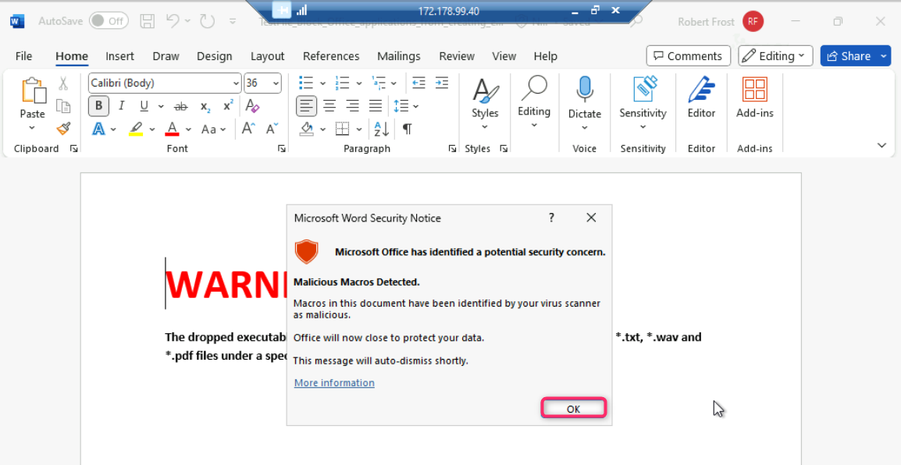

12. Now, open **TestFile+OfficeChildProcess** file in word.

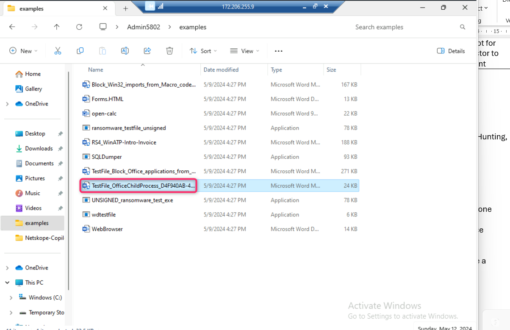

13. Click on **Enable Content**. If you see an error, the action was
    blocked. If you see cmd.exe launch, it was not blocked.

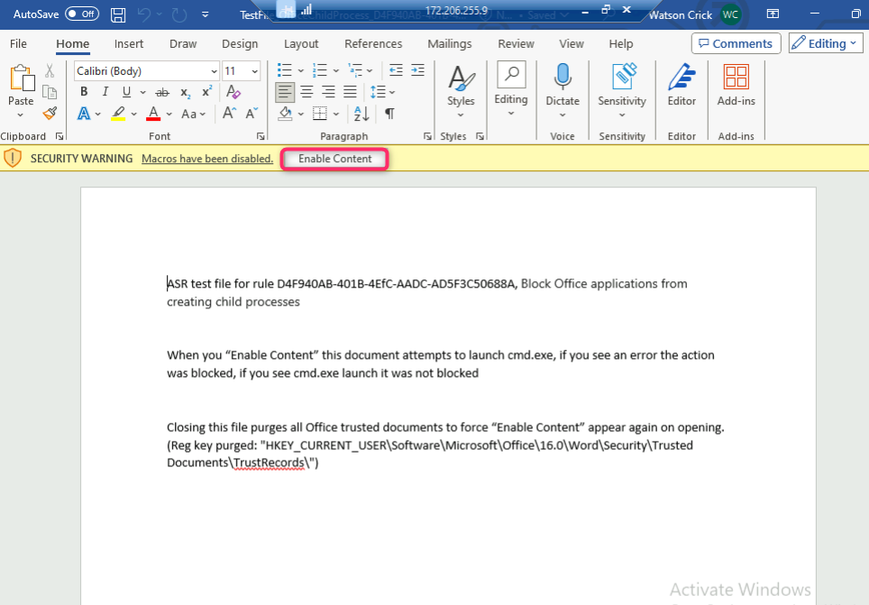

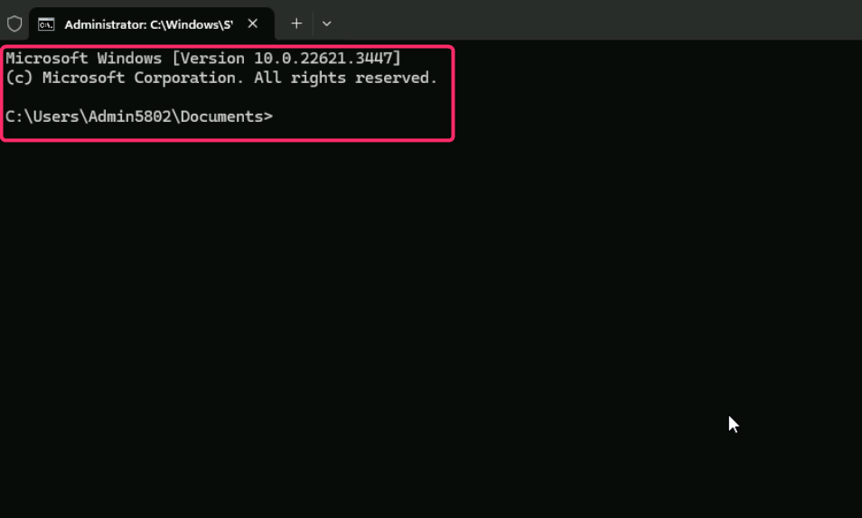

**Running Malicious Script**

**Note**: There are some malicious script that you need to execute to
get the alerts in Microsoft Defender portal. As these scripts are
malicious, the output of the command will not be the same. Sometimes the
script execute, sometimes it will be blocked and you may encounter an
error.

14. Right click inside the folder, then navigate and click on **Open in
    Terminal**.

> 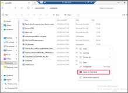 alt="Screenshot" />

15. Type [**ls**](urn:gd:lg:a:send-vm-keys) to get the list of the
    scripts in the folder. Then, execute the following script:

> +++[**./SQLDumper.exe**](urn:gd:lg:a:send-vm-keys)+++
>
>  style="width:6.26806in;height:3.69514in" />

16. Run the following command:

> +++[**.\wdtestfile.exe**](urn:gd:lg:a:send-vm-keys)+++
>
>  style="width:6.26806in;height:3.78819in" />

17. After the command successfully executed, press the **Enter** button.

> 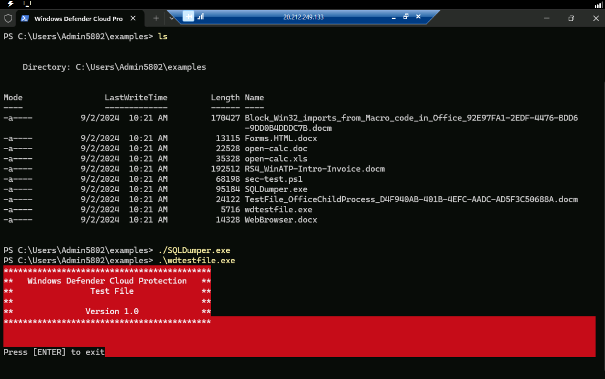 alt="A screenshot of a computer Description automatically generated" />

**Note**: Alerts generated will be started within 15-30 minutes in
Microsoft Defender Portal.

## **Task 3: Performing a ransomware attack using RanSim**

RanSim is a ransomware simulation script written in PowerShell. It
recursively encrypts files in the target directory using 256-bit AES
encryption. RanSim has no self-spreading capabilities and will only run
on the system you execute it on.

1.  Download the RanSim folder in testvm1 using the following script:

**git clone https://github.com/lawndoc/RanSim.git**

2.  In testvm1 search bar, type +++**environment variables**+++, then
    navigate and click on **Edit environment variables for your
    account** as shown in the below image.

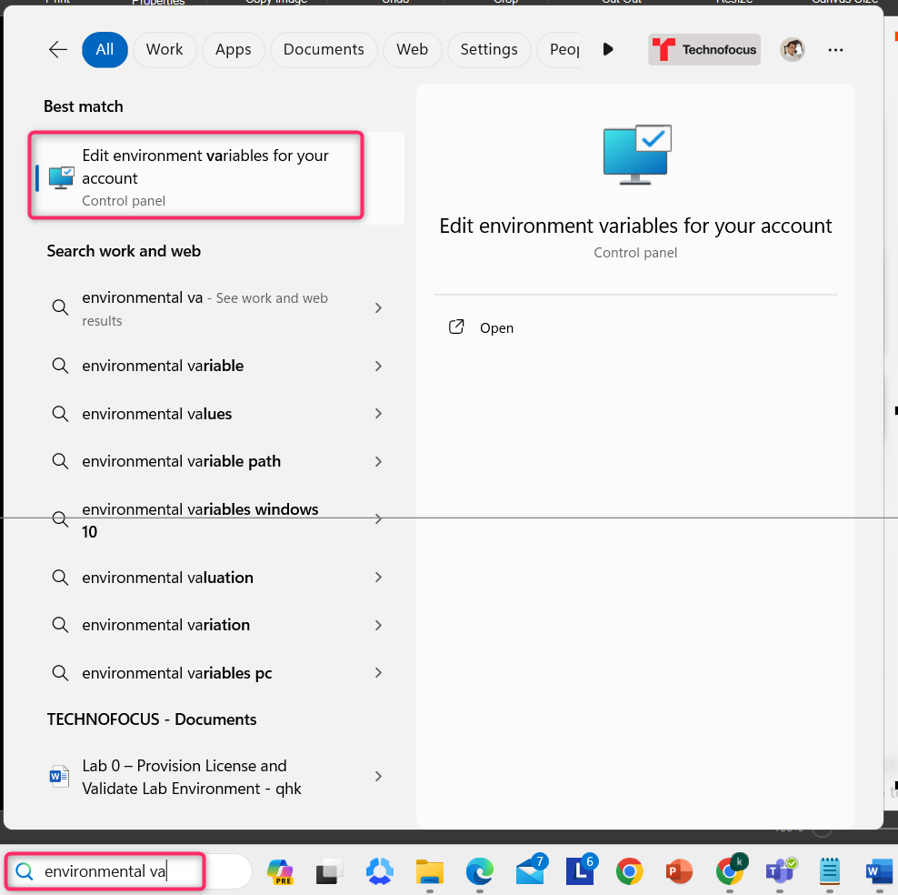

3.  In the **System Properties** dialog box, navigate and click on
    **Environment Variables** button.

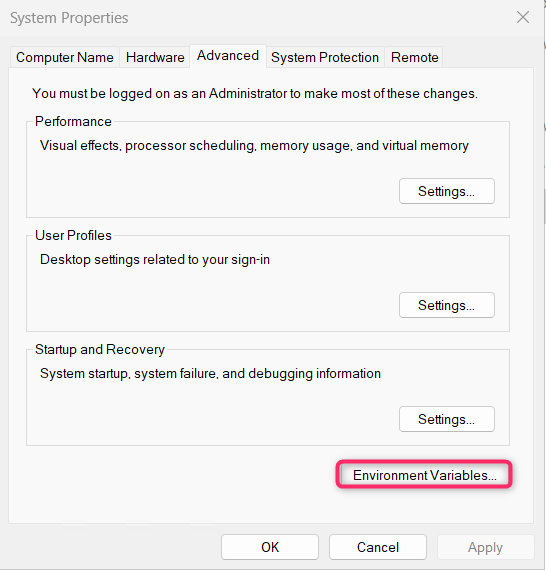

4.  In the **Environment Variables** dialog box, click on the **New**
    button.

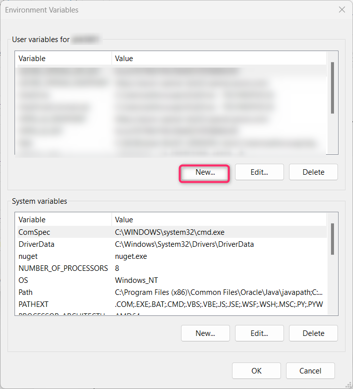

6.  In the next steps, you will be setting the following Parameters:

    - TargetPath : **C:\RanSim**

    - Extension : **.encrypted**

    - Key : **Q5KyUru6wn82hlY9k8xUjJOPIC9da41jgRkpt21jo2L=**

    - TargetFiles : .pdf .xls\* .ppt\* .doc\* .accd\* .rtf .txt .csv
      .jpg .jpeg .png .gif .avi .midi .mov mp3 .mp4 .mpeg .mpeg2 .mpeg3
      .mpg .ogg

7.  On the **New User Variable** dialog box, in the **Variable
    name** field, enter +++**TargetPath+++**, and in the **Variable
    value** field,
    enter +++**[C:\RanSim](urn:gd:lg:a:send-vm-keys)+++**, then press
    the **OK** button.

8.  **TargetPath** variable is successfully added. Now, click on
    the **New** button as shown in the below image.

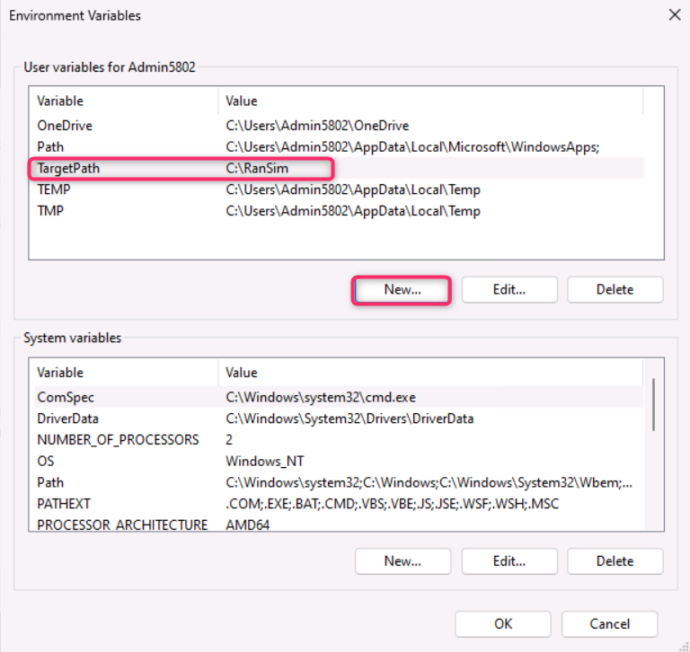

8.  On the **New User Variable** dialog box, in the **Variable
    name** field, enter +++**[Extension](urn:gd:lg:a:send-vm-keys)+++**,
    and in the **Variable value** field,
    enter +++**[.encrypted](urn:gd:lg:a:send-vm-keys)+++**. Then, click
    on the **OK** button.

9.  **Extension** variable is successfully added. Now, click on
    the **New** button as shown in the below image.

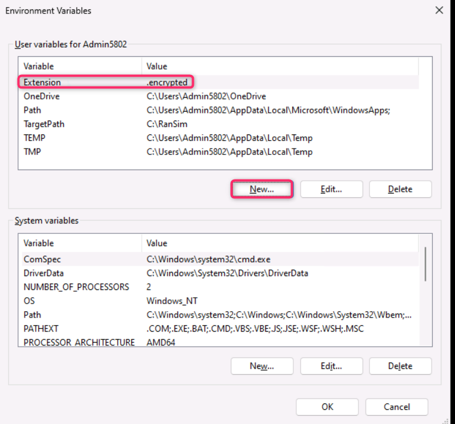

10. On the **New User Variable** dialog box, in the **Variable
    name** field, enter +++**[Key](urn:gd:lg:a:send-vm-keys)+++**, and
    in the **Variable value** field,
    enter +++[**Q5KyUru6wn82hlY9k8xUjJOPIC9da41jgRkpt21jo2L=**](urn:gd:lg:a:send-vm-keys)+++
    Then, click on the **OK** button.

11. **Key** variable is successfully added. Now, click on
    the **New** button as shown in the below image.

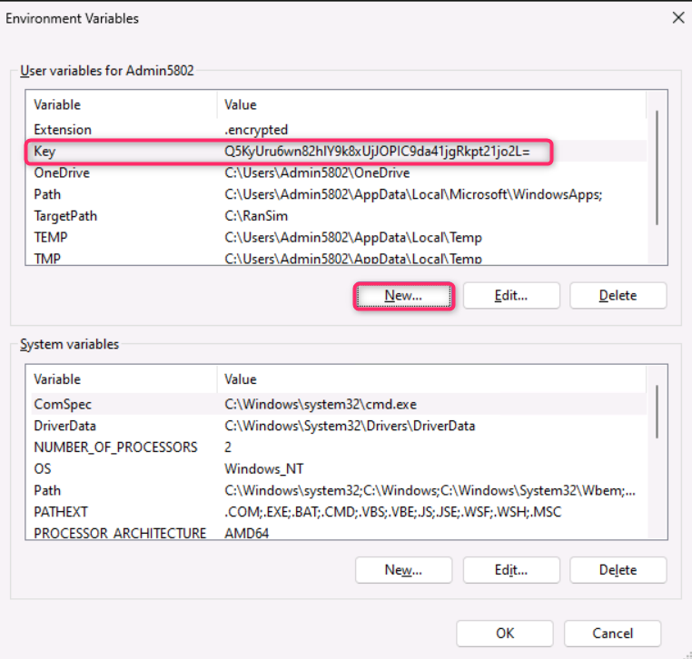

12. On the **New User Variable** dialog box, in the **Variable
    name** field, enter +++**TargetFiles**+++, and in the **Variable
    value** field, enter

+++.pdf .xls\* .ppt\* .doc\* .accd\* .rtf .txt .csv .jpg .jpeg .png .gif
.avi .midi .mov mp3 .mp4 .mpeg .mpeg2 .mpeg3 .mpg .ogg+++

Then, click on the **OK** button.

13. **TargetFiles** variable is successfully added. Close
    the **Environment Variables** dialog box.

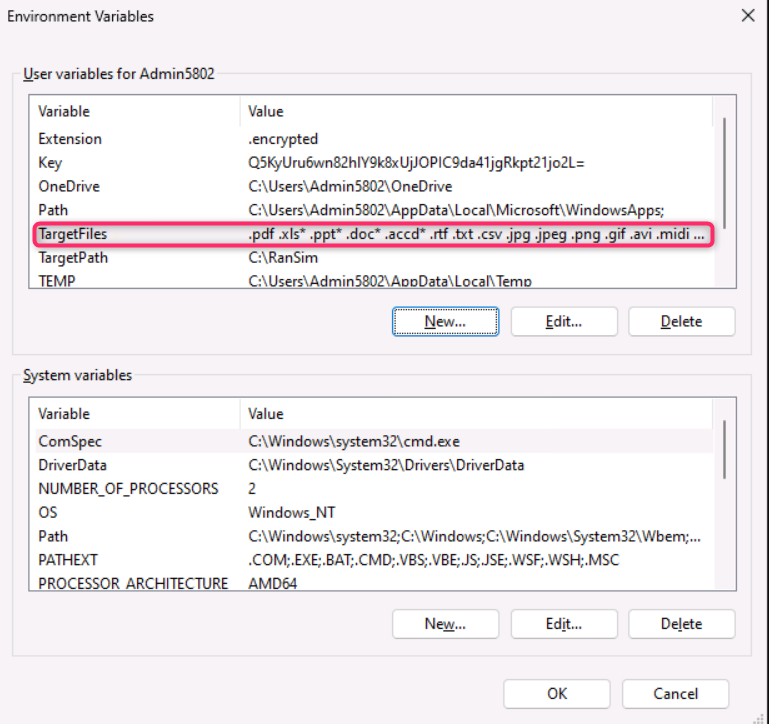

5.  In **testvm1** virtual machine, navigate to **C:\Users\Admin5802\\**
    and copy the **RanSim** folder, then paste the folder in **C:\\**

6.  Open **RanSim** folder. Click anywhere inside the folder, then right
    click and select **Open in terminal**.

**Note:** Please ensure that your RanSim folder is in C:\\

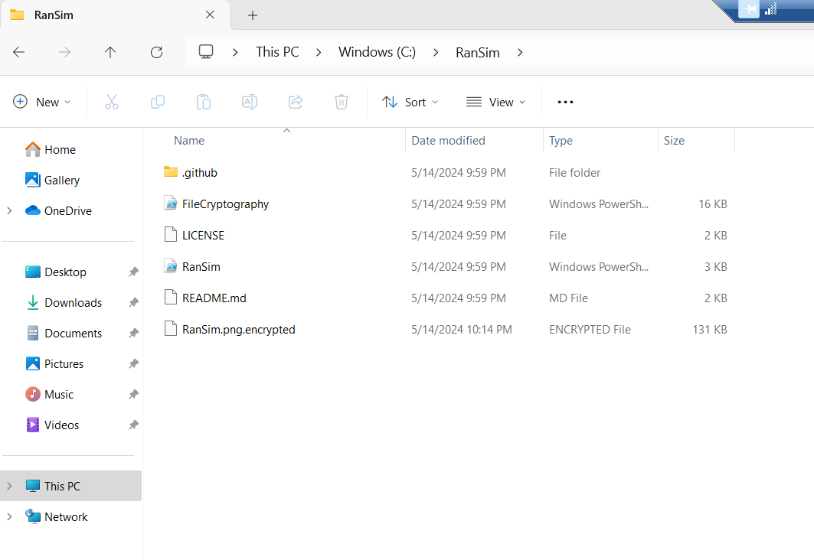

7.  In the command prompt, execute the following command to initiate a
    ransomware attack. In case, the attack failed to execute
    successfully and showed an error, then ignore and move on to the
    next step.

**.\RanSim.ps1 -Mode encrypt**

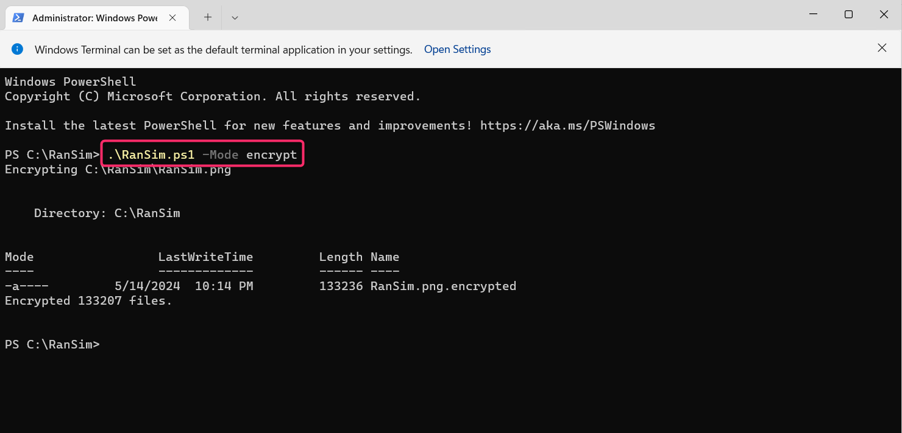

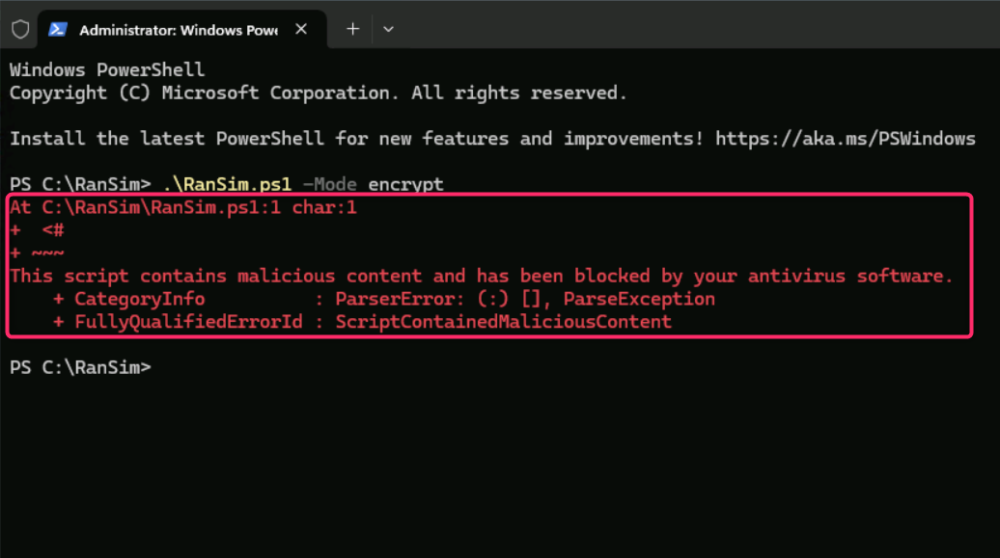

**Task 4: Checking protection action and recommendations from Windows
Security**

1.  In **testvm1** search bar, type **virus and threat protection**,
    then navigate and click on **Virus & threat protection** under
    **Best match** as shown in the below image.

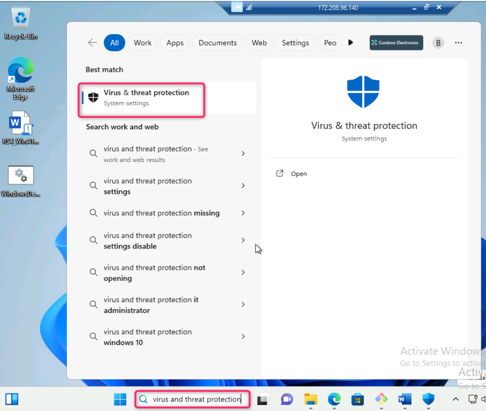

2.  In **Virus & threat protection** page, under **Current threats**
    section, navigate and click on **Protection history**.

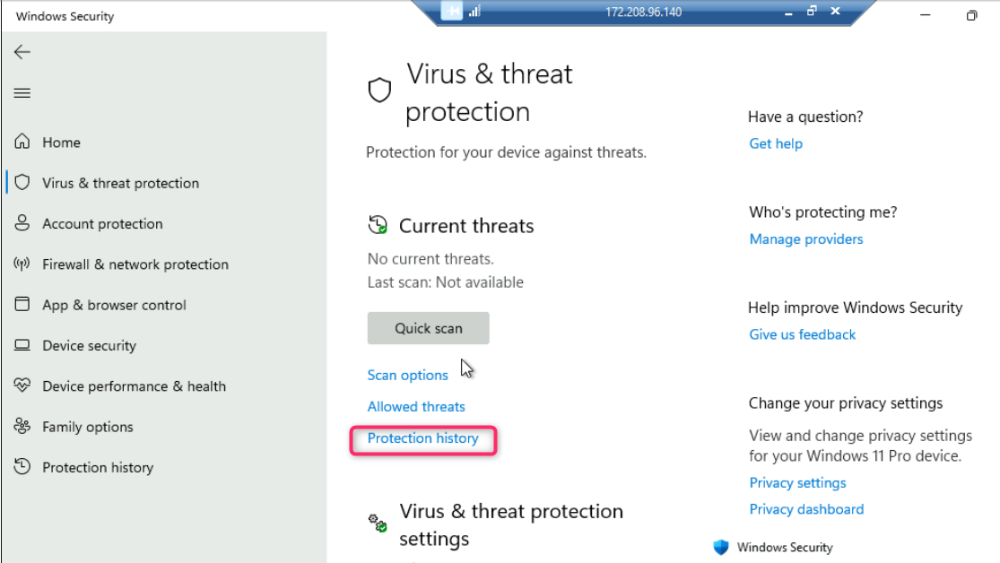

3.  You can see the protection action and recommendations from Windows
    Security.

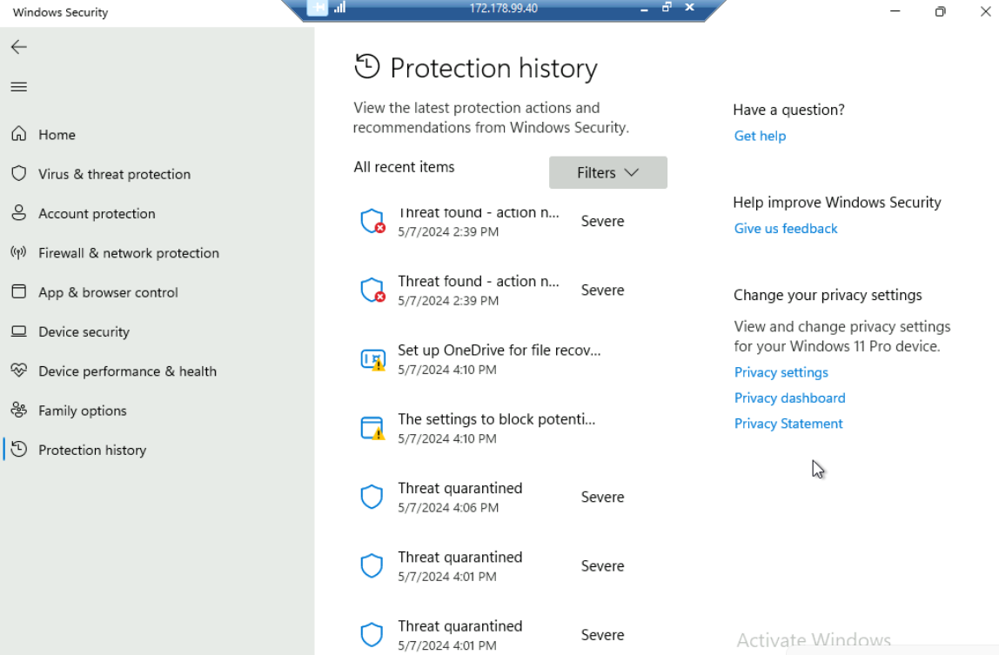

4.  Click on **Threat quarantined** to view the details.

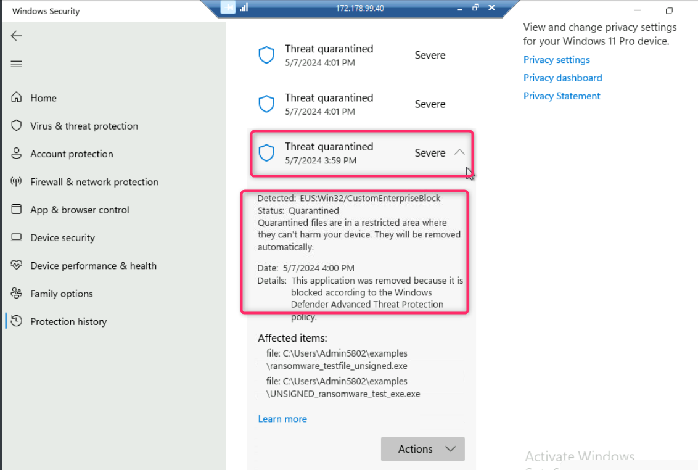

5.  Similarly, click on **Threat blocked** to view the details.

**Summary**

In this lab, you've installed and configured Git on testvm1. You've also
executed malicious documents and scripts. Then, you've simulated a
ransomware attack using RanSim. Then, you've checked the protection
actions and recommendations from Windows Security, examining details of
quarantined and blocked threats. All these activities will create a
multi-stage incident, which will be analyzed in the upcoming labs using
Microsoft Copilot for Security.
