## **Lab 04 - Creating a DLP policy and generating an alert in Microsoft
Purview**

### Introduction

Microsoft Copilot for Security is a cloud-based AI platform that can
assist you in identifying, summarizing, triaging, and remediating alerts
and events in Microsoft Purview for:

- Microsoft Purview Data Loss Prevention (DLP)

- Microsoft Purview Insider Risk Management

- Microsoft Purview Communication Compliance

- Microsoft Purview eDiscovery

It also supports security and compliance professionals in different
scenarios, such as alert and incident response, threat hunting, and
intelligence gathering. For more information about what it can do

### Objectives

- To create a Microsoft Purview account.

- To create custom Data Loss Prevention (DLP) policies for Microsoft
  Copilot for Security.

- To test the effectiveness of the DLP policy by sending simulated
  credit card information to a specific user in Microsoft Teams,
  observing flagged messages, and checking alerts in the Purview portal.

### Task 1: Creating Microsoft Purview Account

1.  In Microsoft Azure portal search bar, type +++**Microsoft Purview
    accounts**+++, then navigate and click on **Microsoft Purview
    accounts** under **Services**.

2.  In the **Microsoft Purview accounts** page, click on **+ Create**.

> 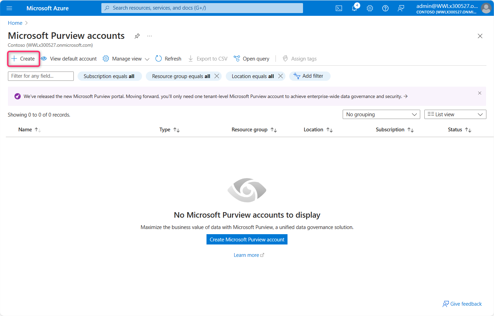 alt="A screenshot of a computer Description automatically generated" />

3.  In the **Create Microsoft Purview account** page, enter the
    following details and click on **Review + Create** button.

| Subscription | Azure Pass |
|----|----|
| Resource group | **MCS-RG** |
| Microsoft Purview account name | Enter the name of your choice (here, we entered **securitycopilot2**) |
| Location | **West Central US** |

>  style="width:6.26806in;height:4.64583in" />

3.  After validation is passed, click on the **Create** button.

> 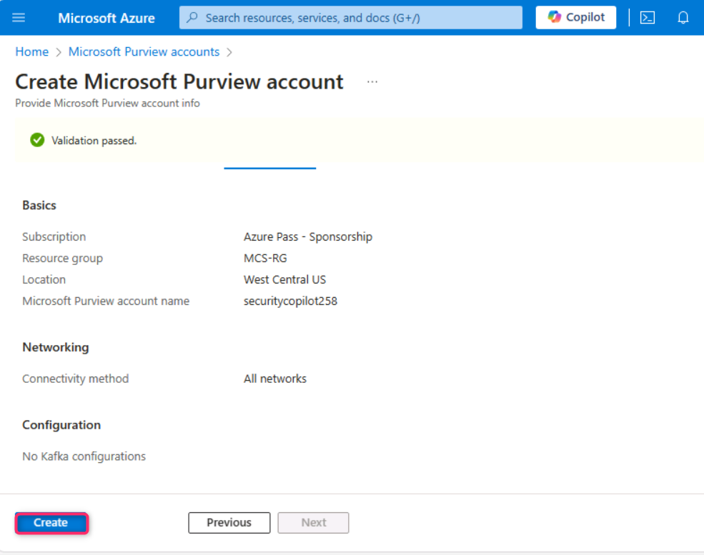 alt="A screenshot of a computer Description automatically generated" />

3.  Open a new tab in the Edge browser address bar and enter the
    following
    URL: [**https://purview.microsoft.com/**](urn:gd:lg:a:send-vm-keys).
    If prompted, then sign in with your O365 tenant credentials. 
    On **Welcome to the new Microsoft Purview portal!** dialog box,
    agree to the terms and conditions, then click on the **Get
    started** button.

> 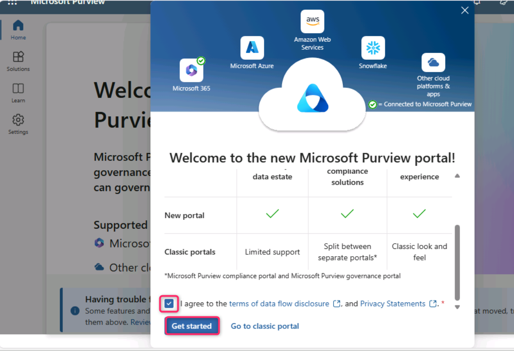 alt="A screenshot of a computer Description automatically generated" />

4.  You'll be directed to Microsoft Purview portal.

> 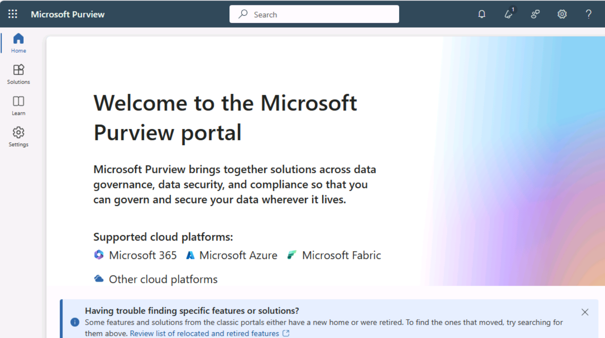 alt="A screenshot of a computer Description automatically generated" />

### Task 2: Setting Custom DLP policies for Microsoft Copilot for Security

1.  In the **Microsoft Purview** portal, navigate to **Solutions**, then
    click on **Data loss prevention** as shown in the below image.

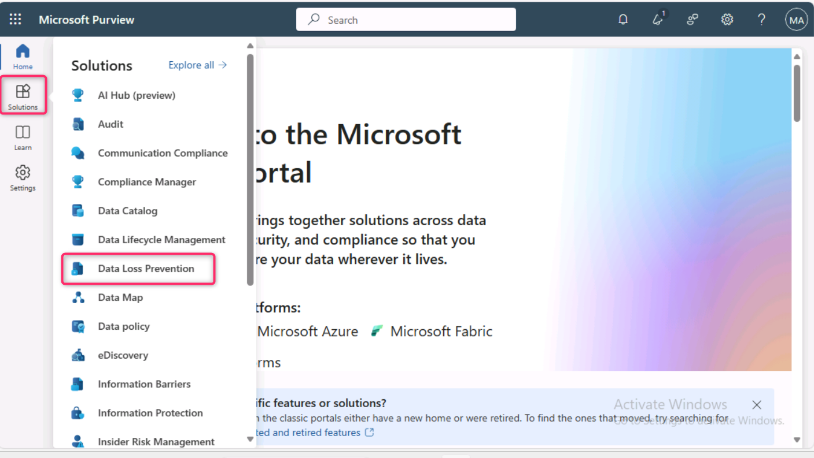

2.  Click on **Policies**. In the **Policies** page, navigate and click
    on **+Create policy**.

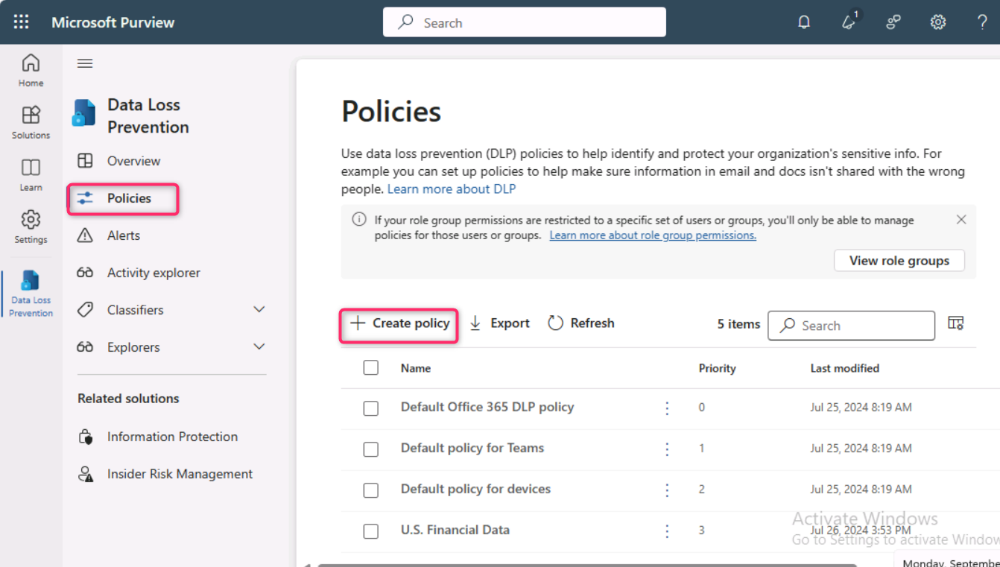

3.  In **Template or custom policy** pane, under **Categories**,
    navigate and click on **Custom**. Under **Regulations**, click on
    **Custom policy**. Then, click on the **Next** button.

4.  On **Name your DLP policy** pane, in the **Name** field, enter the
    following name:

+++**Custom Policy for Microsoft Security Copilot**+++, then click on
the **Next** button.

5.  Leave the **Assign admin units** pane in the default state and click
    on the **Next** button.

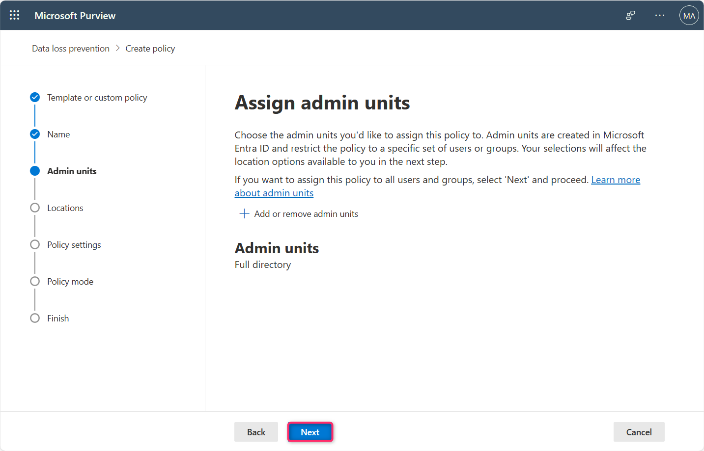

6.  On **Choose where to apply the policy** pane, select the check boxes
    of **Exchange email, Sharepoint sites, OneDrive accounts, Team chat
    and channel messages**, and **Devices**, then click on the **Next**
    button.

> 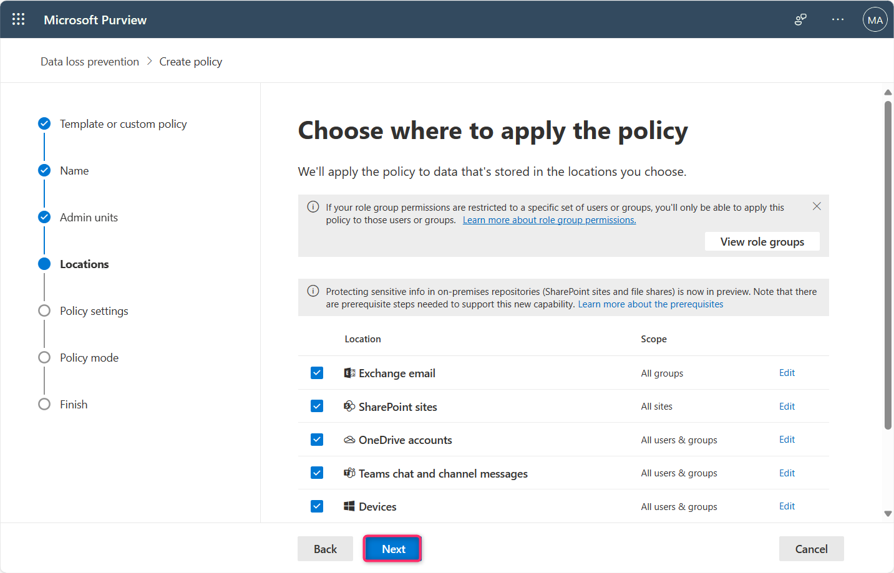 alt="A screenshot of a computer Description automatically generated" />

7.  On **Define policy settings** pane, select the radio button of
    **Create or customize advanced DLP rules** and click on the **Next**
    button.

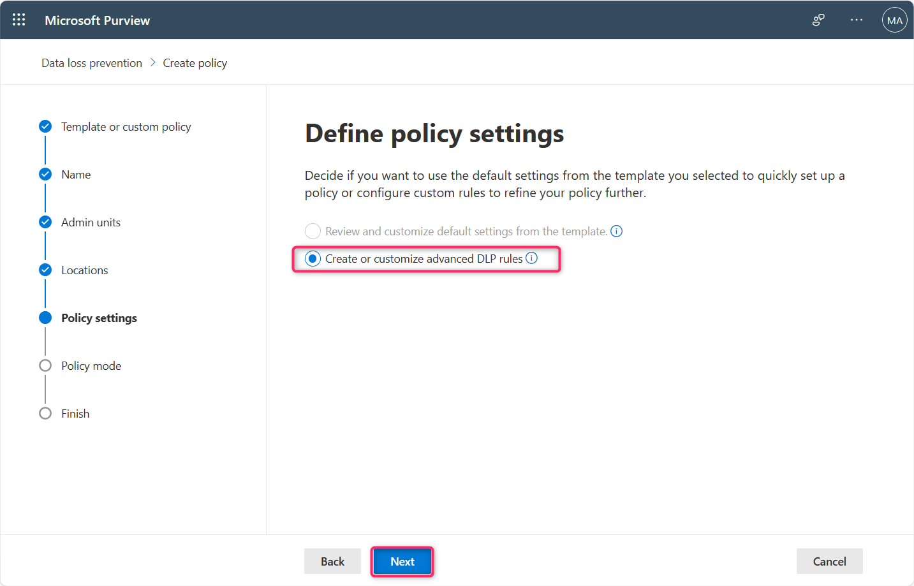

8.  On **Customized advanced DLP rules** pane, click on **+ Create
    rule**.

9.  On the **Create rule** page, in the **Name** field, enter
    **Sensitive Information of Credit Card**.

10. Scroll down to **Conditions** section and click on **+Add
    condition**, then select **Content contains** as shown in the below
    image.

11. In the **Content contains** section, leave **Group name** and
**Group operator** in default state, click on the dropdown beside
**Add** and select **Sensitive info types** as shown in the below image.

12\. In the **Sensitive info types** pane that appear on the right side,
type +++**credit card number**+++ in the search bar and press
the **Enter** button. Select **Credit Card Number** check box, then
click on the **Add** button.

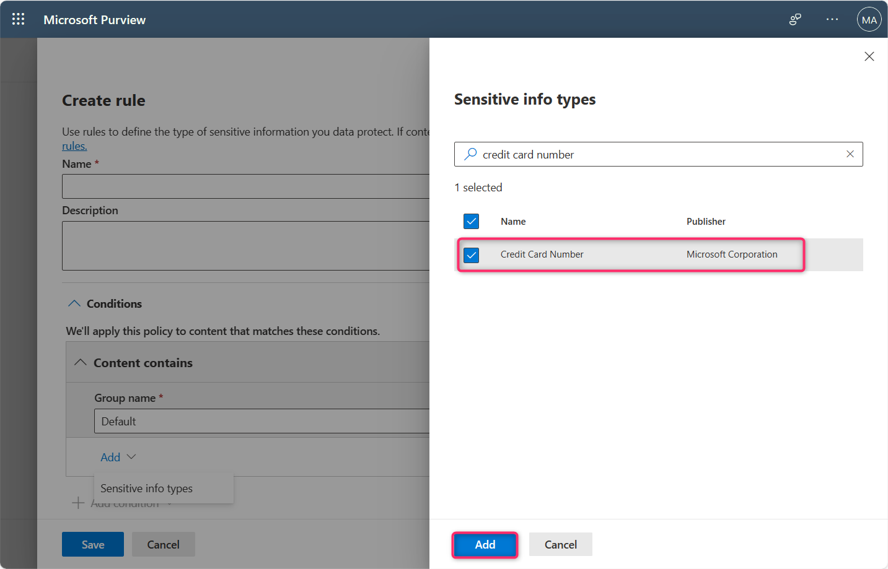

13. Scroll down to **User notifications** section and Turn **On** the
    toggle button.

14. Scroll down to **Incident reports** section, select the severity
    level of the alerts and reports as **High**.

15. Leave all the parameters in the default state and click on the
    **Save** button.

16. Click on the **Next** button.

17. In the **Policy mode** pane, select the radio button of **Turn the
    policy on immediately** and click on the **Next** button.

18. On **Review and finish** pane, carefully review the DLP policy, then
    click on the **Submit** button.

19. The New policy will be created, click on the **Done** button.

20. Navigate and click on **Activity explorer**, then click on **Turn on
    auditing** button as shown in the below image.

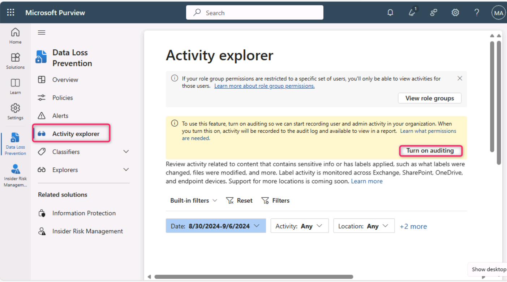

### Task 3: Creating an alert in Microsoft Teams

1.  Click on the horizontal dots beside **Microsoft Purview**, then
    navigate and click on **Teams** as shown in the below image.

> 

2.  In Microsoft Teams search bar, search and select the name of user -
    **Robert Frost**.

>  style="width:6.00121in;height:3.84308in" />

3.  Test the DLP policy that you have created using the following
    **Credit Card Type** and **Credit Card Number**. Select the name of
    the Credit Card along with the number and send that information in
    team to Robert Frost.

| **Credit Card Type**   | **Credit Card Number** |
|------------------------|------------------------|
| +++American Express+++ | +++378282246310005+++  |
| +++JCB+++              | +++3566002020360505+++ |
| +++MasterCard+++       | +++5105105105105100+++ |
| Visa                   | +++4012888888881881+++ |

> You’ll observe that your message was flagged every time.
>
>  style="width:6.26806in;height:3.63403in" />
>
> 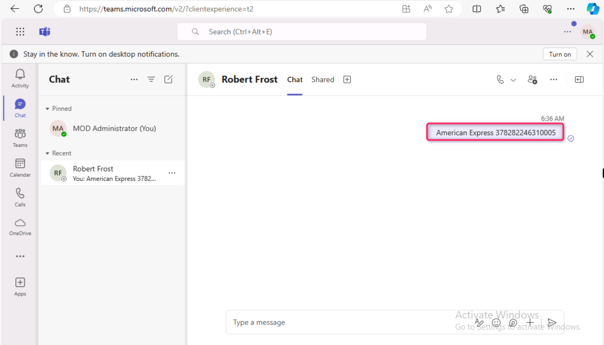 alt="A screenshot of a computer Description automatically generated" />
>
>  style="width:6.26806in;height:3.77569in" />

4.  In the **Data Loss Prevention** section, navigate and click on
    **Alerts**, you’ll see the Alerts stating – **DLP policy match for
    Teams conversation** along with the **Severity** and **Status** of
    the alerts.

> 

**Note**: Sometimes alert generation can take up to 30-60 minutes.

5.  Enter the following data to trigger the alerts. Similarly, you can
    enter random information in this format:

> +++Katie Jordan+++
>
> +++Credit Card Account number: Visa 45562411537761660+++
>
> +++Debit Card Account number: MasterCard 5439683992731720+++
>
>  style="width:6.26806in;height:3.83958in" />
>
> **Note**: You’ll analyze the alerts generated through the Custom DLP
> policy using Microsoft Copilot for Security in the upcoming task. As
> the SCU consume a lot of credits; therefore, to prevent unnecessary
> credit loss, we’ve moved this task in the next lab.

**APPENDIX**

1.  In case you did not see the alerts, then click on **Policies**,
    select **Custom Policy for Microsoft Copilot for Security**, then
    click on the **Edit** icon as shown in the below image.

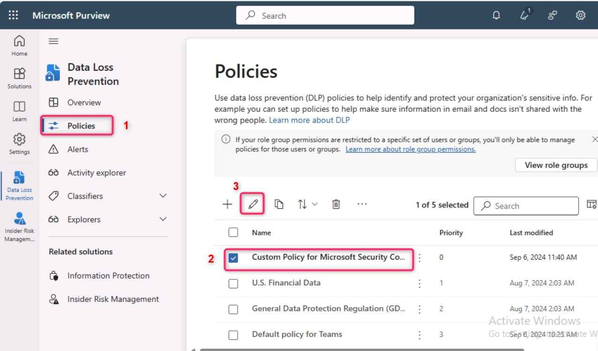

2.  Navigate to **Name \> Admin units \> Locations \> Advanced DLP
    rules**, click on the **Edit** icon.

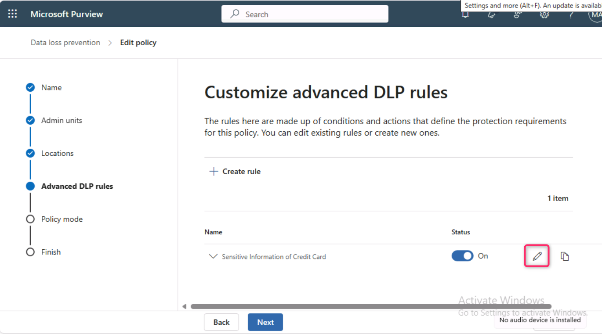

3.  Scroll down **to User notifications** section and turned the toggle
    **On** if it is **Off**, then click on the **Save** button.

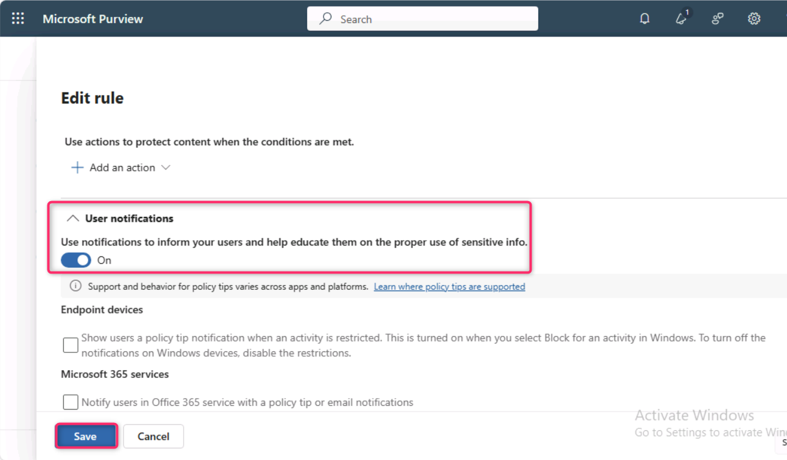

**Summary**

In this lab, you’ve set up a Microsoft Purview account, then you’ve
configured custom Data Loss Prevention (DLP) policies for Microsoft
Copilot for Security, and created alerts in Microsoft Teams to test the
effectiveness of these policies. This hands-on exercise has equipped you
with valuable skills in data protection and compliance management within
Microsoft's ecosystem, enhancing your understanding of security measures
in cloud-based environments.
