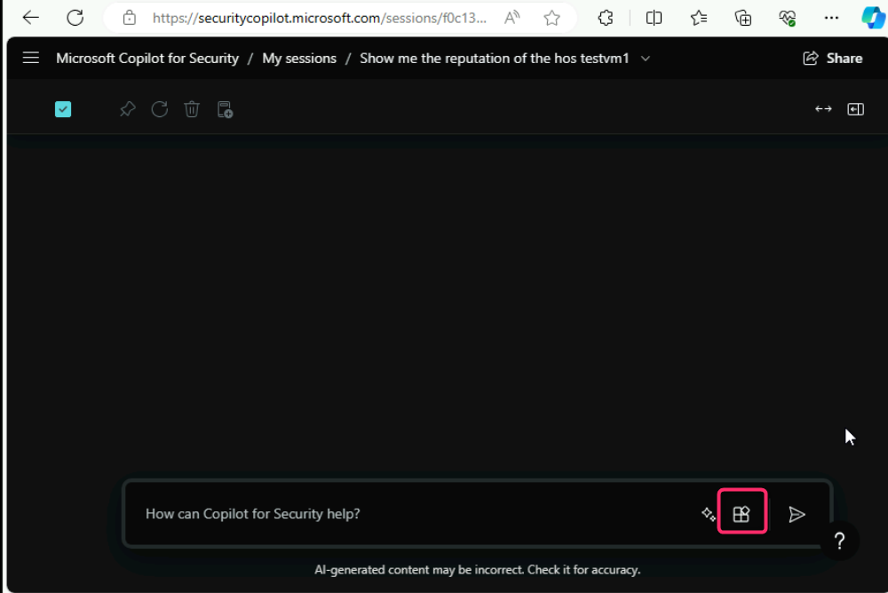

**Lab 5 - Activating Security for Copilot using Azure subscription and
analyzing the alerts generated in Microsoft Purview**

**Introduction**

Copilot for Security is a generative AI security product that empowers
security and IT professionals respond to cyber threats, process signals,
and assess risk exposure at the speed and scale of AI. In this lab,
you’ll be activating Security for Copilot utilizing Azure subscription
and analyzing the alerts generated in Microsoft Purview.

**Objectives**

- To set up Microsoft Copilot for Security capacity in Azure portal.

- To change the SCU units.

- To analyze the Custom DLP Policy Alert using Microsoft Copilot for
  Security

**Task 1: Setting up Microsoft Copilot for Security capacity in Azure
portal**

1. In the Microsoft Azure portal search bar, type **Microsoft Copilot
for Security compute capacity** and then click on it.

2. In **Microsoft Copilot for Security compute capacity** window, click
on **+ Create.**

3. In **Set up your Copilot capacity** page, in the **Resource group**
field, click on the dropdown and select **MCS-RG**. Then, in the
Capacity name field, enter the capacity name (here, we entered
**SCU5801**). In the Prompt evaluation location field, click on the
dropdown and select **United States (US)**.

4. In the **Security compute units per hour** field, click on the
dropdown and select 1. Select the checkbox of acknowledgement and click
on **Review + create** button.

5. Click on the **Create** button.

6. Click on **View resource** button.

7. Again, in the Azure portal search bar, type **Microsoft Copilot for
Security compute capacities**, navigate and click on it.

8. Click on the security capacity unit that you’ve deployed (here,
**SCU5801**).

9. In the **SCU5801** Microsoft Copilot for Security compute capacity
page, navigate and click on **Access control (IAM)**.

10. Click on **+Add**. Then, navigate and click on **Add role
assignment**.

12. Click on **Privileged administrator roles** tab, navigate and click
on **Owner** role, then click on the **Next** button as shown in the
below image.

13. Click on **+Select members**.

14. In the **Select members** pane that appear on the right side,
navigate to **Select** field and enter your O365 tenant ID, then select
it as shown in the below images.

15. Click on the **Next** button.

16. In the **Conditions** tab, select the **Allow user to assign all
roles (highly privileged)** radio button and then click on the **Next**
button.

17. Click on **Review + assign** button.

18. Click on **Overview**.

19. Scroll down and click on **Go to portal and complete setup link**
as shown in the below image.

20. You’ll be directed **to Microsoft Copilot for Security** page. If
you see a dialog box – **Are you familiar with cookies?**, then click on
the **Accept** button.

21. Click on **Get started** button.

22. In **Select the capacity you’d like to use** page, click on the
dropdown and select the SCU capacity that you’ve created (here, we
selected **SCU5801**), then click on the **Continue** button.

23. In **Your Customer Data will be stored in United States** page,
click on the **Continue** button.

24. In **Help improve Copilot** page, click on the Continue button.

25. Click on **Continue** button.

26. In **You’re all set** page, click on the **Finish** button.

27. Microsoft Copilot for Security is successfully activated.

**Task 2: Changing SCU units**

While using the prompt in Microsoft Copilot for Security, you will
encounter a message stating that your SCU units have been consumed and
you need to increase the SCU units. In this task, you will learn how to
increase the SCU units in Microsoft Copilot for Security Standalone.

1.  In Microsoft Copilot for Security window, click on the three
    horizontal ellipsis and click on **Owner settings**.

2.  Navigate to **Security compute units** and click on the **Change**
    button.

3.  Select **9** Security compute units and click on the **Apply**
    button.

4.  On **9 capacity units are now available to use** dialog box, click
    on the **Done** button.

 

 5. Click on **Microsoft Copilot for Security** at the top bar of the
 window as shown in the below image.

 

 **Task 3: Analyzing the Custom DLP Policy Alert using Microsoft
 Copilot for Security**

1.  In Microsoft Copilot for Security Standalone, navigate and click on
    **Source** icon beside the prompt bar as shown in the below image.

 

2.  Click on **Show 9 more**, then navigate to **Microsoft Purview** and
    ensure that the toggle is turned on as shown in the below images.

 

 

3.  Go back to Microsoft Purview. In the **Data Loss Prevention**
    section, navigate and click on **Alerts**, you’ll see the Alerts
    stating – **DLP policy match for Teams conversation** along with the
    **Severity** and **Status** of the alerts.

 

4.  In the **Alert: DLP policy match for Teams conversation** pane,
    click on **Summarize with Copilot** button as shown in the below
    image.

- 

5.  Carefully review the **Alert summary**.

 

6.  Go back to Microsoft Copilot for Security Standalone mode and enter
    the following prompt:

+++**Which Purview Data Loss Prevention alerts should I prioritize
today?**+++

 

7.  The top 10 Microsoft Purview DLP alerts will be displayed along with
    **Alert ID** and **Severity**, carefully review them.

 

**Summary**

In this lab, you’ve configured Microsoft Copilot for Security capacity
in Azure portal and learned how to increase the SCU units. Then, you’ve
analyzed the Custom DLP Policy Alert using Microsoft Copilot for
Security.
