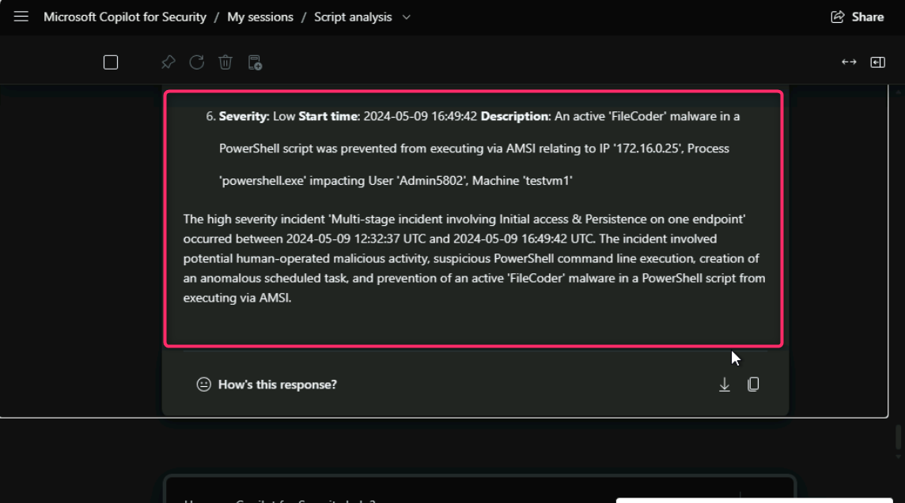

## Lab 6 - Copilot for Security – Microsoft Defender embedded copilot to standalone copilot investigation

**Introduction**

Copilot for Security is embedded in the Microsoft Defender portal to
enable security teams to efficiently summarize incidents, analyze
scripts and codes, analyze files, summarize device information, use
guided responses to resolve incidents, generate KQL queries, create
incident reports.

- **Investigate and respond to incidents like an expert**: Enable
  security teams to tackle attack investigations in a timely manner with
  ease and precision. Copilot helps teams to understand attacks
  immediately, quickly analyze suspicious files and scripts, and
  promptly assess and apply appropriate mitigation to stop and contain
  attacks.

- **Summarize incidents quickly**: Investigating incidents with multiple
  alerts can be a daunting task. To immediately understand an incident,
  you can tap Copilot to summarize an incident for you. Copilot creates
  an overview of the attack containing essential information for you to
  understand what transpired in the attack, what assets are involved,
  and the timeline of the attack. Copilot automatically creates a
  summary when you navigate to an incident's page.

**Objectives**

**Task 1: Investigate the Incident in Microsoft Defender embedded
copilot**

1.  In the Microsoft Defender portal, navigate and click
    on **Investigation & response**, then select **Incidents & alerts**,
    click on **Incidents**. In the **Incidents** page, navigate and
    click on the **Multi-stage incident involving Execution &
    Persistence on one endpoint**.

2.  On the **Multi-stage incident involving Execution & Persistence on
    one endpoint** pane, Copilot for security automatically creates an
    **Incident summary**. Review the incident summary thoroughly.
    

### **Task 2: Analyze malicious scripts in embedded and standalone copilot for security**

Most attackers rely on sophisticated malware when launching attacks to
avoid detection and analysis. These malwares are usually obfuscated, and
might be in the form of scripts or command lines in PowerShell. Copilot
can quickly [analyze
scripts](https://learn.microsoft.com/en-us/defender-xdr/security-copilot-m365d-script-analysis),
reducing the time for investigation.

1\. In the **Incidents & alerts** page, navigate and click on
**Alerts**. Then, click on **Suspicious PowerShell download or encoded
command execution.**

3.  Navigate to **powershell.exe** and click on the dropdown as shown in
    the below image.

4.  Click on **Analyze**.

5.  In **Copilot** pane, navigate and click on **Show code**, then
    review the code.

6.  Scroll up and click on the horizontal ellipsis, then navigate and
    click on **Open in Copilot for Security** to open the Standalone
    Copilot for Security.

7.  Then, enter the following prompt - +++**[Provide the key findings of
    script analysis](urn:gd:lg:a:send-vm-keys)+++**

>  style="width:6.26806in;height:3.86319in" />

8.  Carefully review the key findings of script analysis.

>  alt="A screenshot of a computer Description automatically generated" />
>
>  alt="A screenshot of a computer Description automatically generated" />

9.  In Microsoft Copilot for Security Standalone, enter the following
    prompt to obtain the summary of the incident.

+++**Provide me a summary of defender incident 5**+++

**Note**: Number \#5 represent the Incident ID, you may have a different
Incident ID. To know about your Incident ID, navigate to Microsoft
Defender portal, click on Incidents and you will find the Incident ID in
**Multi-stage incident involving Execution & Persistence on one
endpoint** row.

10. Carefully review the Incident summary.

11. Then, enter the following prompt - +++**Extract the entities from
    script analysis**+++

12. Carefully review the extracted entities from script analysis.

13. Use the following prompt to generate a report about the incident.

+++**Write a report summarizing the incident**+++

### Task 3: Analyze files promptly

Copilot helps security teams quickly assess and understand suspicious
files with file analysis. Copilot provides a file's summary, including
detection information, related file certificates, a list of API calls,
and strings found in the file.

1.  In Microsoft Defender portal, click on the **Incidents**, then click
    on **Multi-stage incident involving Execution & Persistence on one
    endpoint**.

2.  Click on **Attack story** tab, then navigate to the Incident graph
    and select **Files**.

3.  Right click on **Files** icon, then navigate and select **File
    details**. In case, you see **View 2 Files**, then select it.

> **Note**: The number of Files may vary.
>
>  alt="A screenshot of a computer Description automatically generated" />

4.  If there are more than one file, then navigate and click
    on **WinATP-Intro-Backdoor.exe**

5.  In the **WinATP-Intro-Backdoor.exe** pane, navigate and click on
    **Open file page**.

6.  Review the **File analysis** information provided by Copilot for
    Security.

### **Task 4: Generate device summaries**

Investigating devices involved in incidents can be a tasking job. To
quickly assess a device, Copilot can summarize a device's information,
including the device's security posture, any unusual behaviors, a list
of vulnerable software, and relevant Microsoft Intune information.

1\. Navigate and click on **Assets** and then click on **Devices**.

2\. Select **testvm1**.

3\. Copilot for security automatically provides **Device summary**.

**Task 5: Microsoft Defender Incident Investigation using Copilot for
Security Promptbook Library**

1.  In Microsoft Copilot for Security Standalone, navigate and click on
    the three horizonal ellipsis, then click on **Promptbook library**.

2.  In the Promptbook library page, select **Microsoft 365 Defender
    incident investigation**.

3.  Go back to Microsoft Defender portal, click on **Incident &
    alerts**, then click on **Incident**. Note down the Incident ID
    mentioned beside the generated incident. You may have a different
    incident ID.

4.  Go back to Microsoft Copilot for Security, click on **Start new
    sesssion** button, in the **Defender Incident ID** field, enter your
    incident ID (here, we entered 5, you may have different Incident ID)
    and click on the **Submit** button.

5.  Carefully review the Microsoft 365 Defender incident investigation
    report generated using the prompt library.

**Summary**

In this lab, you've learned to leverage Microsoft Defender's embedded
and standalone Copilot for Security to investigate and analyze security
incidents. You've navigated to the Defender portal, investigated
multi-stage incidents, and used Copilot to generate incident summaries.
You've developed the skills in analyzing malicious scripts, particularly
obfuscated PowerShell commands, by reviewing key findings and generating
incident summaries. Additionally, you've learned to assess suspicious
files through detailed file analysis and quickly evaluated device
security postures, enhancing the overall incident response and security
investigation capabilities.
