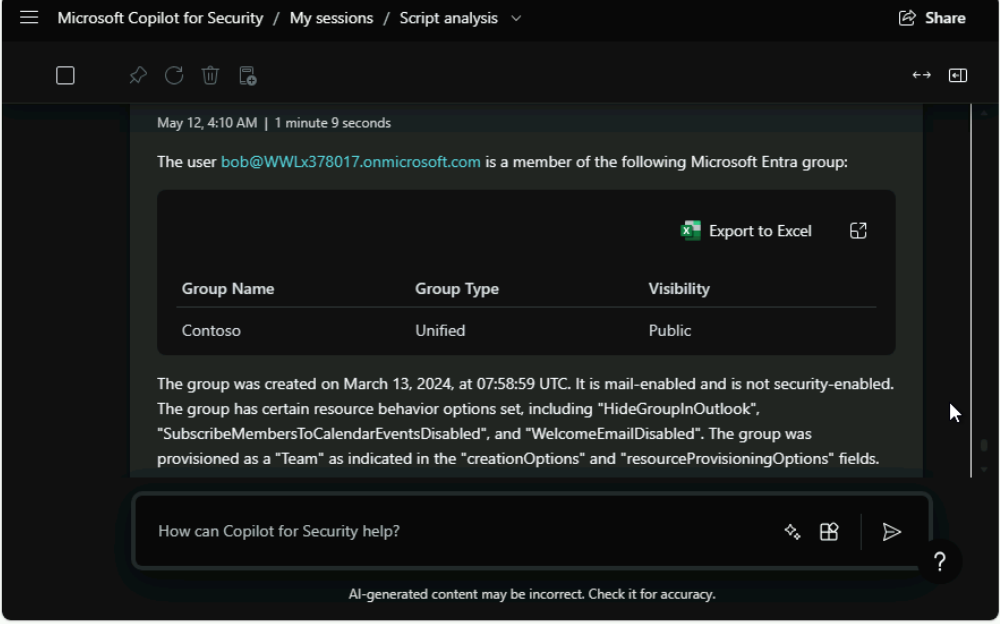
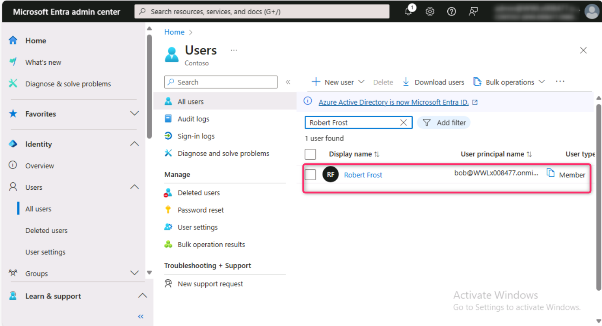
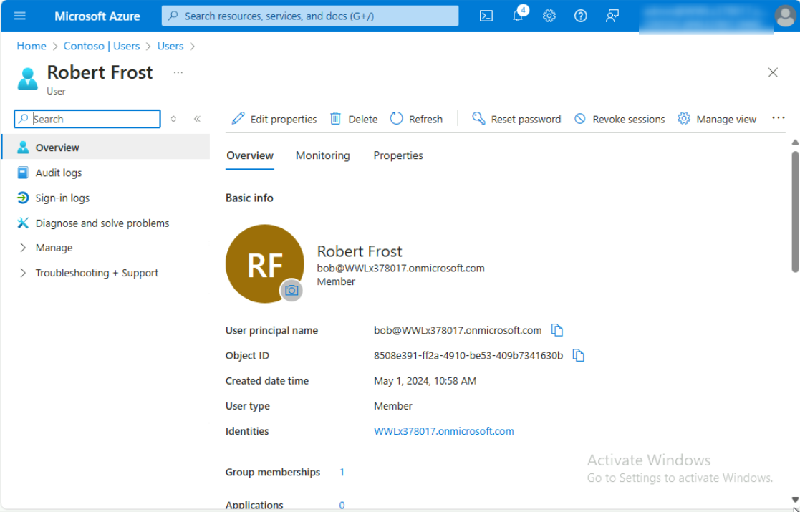
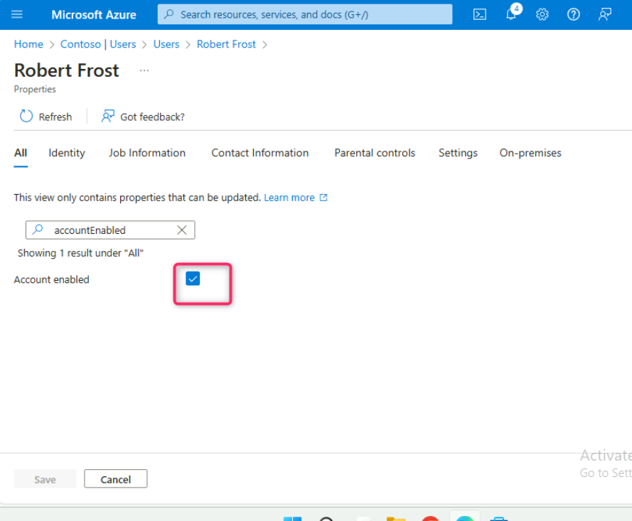
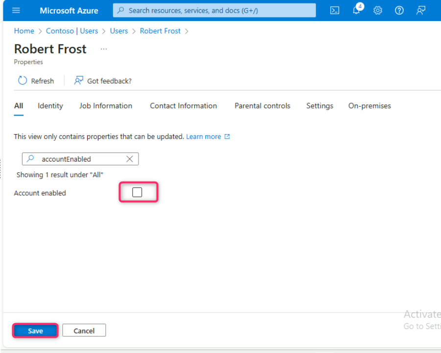
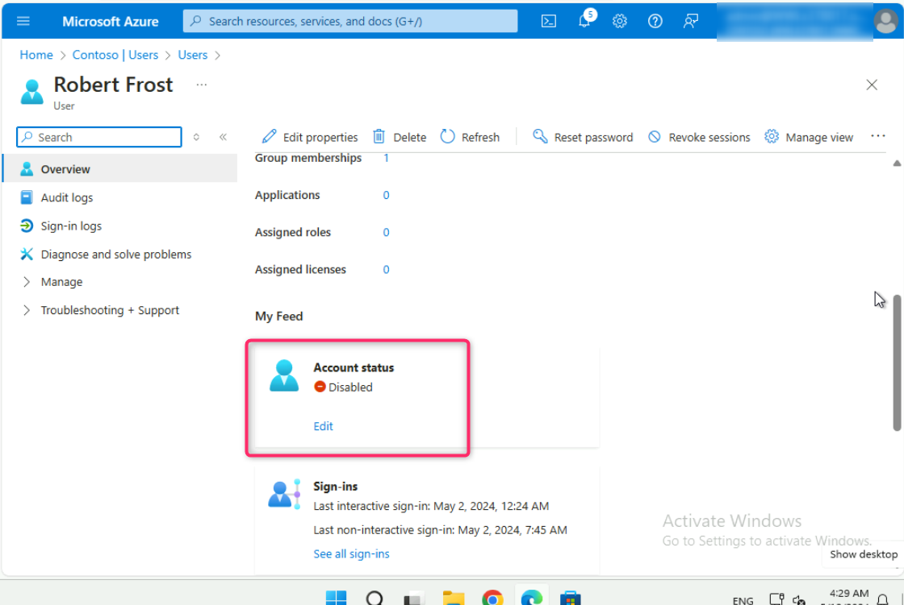

**Lab 7 - Identity Risk Investigation and Mitigation with Microsoft
Copilot for Security in Microsoft Entra**

**Introduction**

Copilot for Security is embedded in Microsoft Entra so you can
investigate and resolve identity risks, assess identities and access
with AI-driven intelligence, and complete complex tasks quickly.
Microsoft Copilot in Microsoft Entra gets insights from your Microsoft
Entra users, groups, sign-in logs, audit logs, and more.

You can explore sign-ins and risky users and get contextualized insights
on how to resolve incidents and what to do to protect the accounts in
natural language. Built on top of real-time machine learning, Copilot in
Microsoft Entra can help you find gaps in access policies, generate
identity workflows, and troubleshoot faster. You can also unlock new
skills that allow admins at all levels to complete complex tasks such as
incident investigation, sign-in log analysis, and more, to gain savings
in time and resources.

**Objectives**

- To obtain information about the user involved in the security incident
  and to check the account status of the user.

- To disable the compromised user account in Microsoft Entra.

**Task 1: Obtaining the details of the user involved in the security
incident**

1.  In Microsoft Copilot for Security Standalone, navigate and click on
    **Source** icon beside the prompt bar as shown in the below image.

2.  Ensure that the **Microsoft Entra** plugin is turned on.

3.  Close **Manage sources** window and go back to prompt bar. Enter the
    following command to obtain information related to the user group.

> **Note**: You'll have a different domain name for the user, change the
> domain name accordingly.

+++**Get the Microsoft Entra user groups that
<bob@WWLxXXXXX.onmicrosoft.com> is a member of. Put information in table
format.**+++

4.  Use the following prompt to obtain the specific user details
    involved in a security incident.

*+++***Give me all user details for <bob@WWLxXXXXX.onmicrosoft.com> and
extract the user Object ID***+++*

5.  Click on **User Management page** link as shown in the below image.

**Task 2: Disabling User account involved in a security incident**

1.  In the **Users** page search bar, enter the name of the user and
    press the enter button (here, we've entered **Robert Frost**). Then,
    click on the displayed name.

>  style="width:6.26806in;height:3.44306in" />
>
>  alt="A screenshot of a computer Description automatically generated" />

2\. In the user name page, scroll down to Account status section and
click on **Edit** as shown in the below image.

3\. Uncheck the Account enabled box and click on the **Save** button.

4\. Scroll down to Account status section, you’ll notice that the
Account status is turned as **Disabled**.

**Summary**

The lab aimed to mitigate a security incident by obtaining and disabling
the user account involved. In this lab, you’ve utilized Microsoft
Copilot for Security Standalone to extract user group information and
specific user details, including the user's Object ID. Then, you’ve
checked the account status of the user and immediately disabled the user
account in Microsoft Entra. This proactive approach to identify and
promptly acting on compromised user accounts demonstrates a crucial step
in mitigating security threats effectively.
